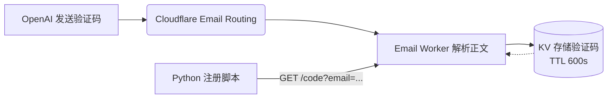

# OpenAI 自动注册脚本 (Cloudflare Worker 验证码方案)

本项目是一个高度自动化、无需配置传统 IMAP 邮箱的 OpenAI 账户批量注册与 Token 获取工具。

通过使用 **Cloudflare Email Routing + Cloudflare Worker + KV** 方案，彻底解决了传统接码平台和自建邮箱繁琐的 IMAP 收信问题，实现极速提取验证码（OTP）。

> 💡 **高阶玩法搭配**：本项目执行后批量提取的账号与 Token 文件，可**完美搭配 [CLIProxyAPI](https://github.com/router-for-me/CLIProxyAPI) 项目使用**！你可以将生成的 Token 池导入该项目，轻松实现多账号自动轮询、负载均衡以及高并发的 OpenAI API 代理分发服务。

## 💡 方案优势（为什么不用 IMAP）

传统的批量注册方案通常需要购买域名邮箱，并通过 IMAP 协议在代码中轮询收件箱。这种方案缺陷明显：账号易被封、网络容易超时、解析复杂。

**本项目的全新方案：**

1. 邮件到达 Cloudflare 瞬间触发 Worker，毫秒级解析出 6 位验证码写入 KV。
2. 注册脚本只需通过极其稳定的 HTTP GET 请求，带着 API Key 安全地把验证码拿走。
3. 彻底告别邮箱服务器封禁、IMAP `FETCH` 失败、解析超时等各种烦恼！

---

## 🚀 准备工作（必读）

如果你是小白，请仔细阅读本节，按照以下前提条件准备：

1. **一个属于你自己的域名**，并且该域名**必须已经托管到 Cloudflare**（如果你还没托管，请务必看下方*第零步*）。
2. **科学上网环境（避开 CN/HK 节点）**：OpenAI 屏蔽中国大陆和香港 IP，请配置好可靠的全局代理或软件内代理。

---

## 🌐 第零步：使用 Cloudflare 托管你的域名（小白必看）

如果你的域名刚刚在各大厂商（如 Namesilo / 腾讯云 / 阿里云 / GoDaddy / Spaceship 等）购买，请按照以下**最新版 Cloudflare 托管流程**将域名的 DNS 解析权交给 Cloudflare：

1. 登录 [Cloudflare Dashboard](https://dash.cloudflare.com/)，在主页点击右上角的 **Add a Site (添加站点)**。
2. 输入你刚刚购买的域名（例如 `yourdomain.com`），点击继续。
3. 往下拉，选择底部的 **Free (免费)** 计划，点击继续。
4. Cloudflare 会自动扫描你域名当前的各种 DNS 解析记录（直接无视，一直点继续/确认）。
5. **最关键的一步**：Cloudflare 此时会分配给你两个唯一的 **名称服务器 (Nameservers)**，例如：
   - `diana.ns.cloudflare.com`
   - `igor.ns.cloudflare.com`
6. 回到你**购买域名的厂商后台**，找到当前域名的 **DNS / Nameservers（名称服务器 / DNS 修改）** 设置项。
7. 选择“使用自定义 Nameservers”，然后将原有的服务器全部删除，替换填写为 Cloudflare 刚刚分给你的那两个网址。
8. 确认保存。DNS 生效通常需要 5 分钟到 24 小时不等。回到 Cloudflare 页面点击 **“核实名称服务器”**。
9. 当你的 Cloudflare 主页上看到该域名显示绿色的 **Active (有效)** 状态时，恭喜你，托管成功！后续所有操作都在 Cloudflare 面板进行。

---

## 🛠️ 第一部分：Cloudflare 环境配置（核心）

本项操作只需配置一次，后续脚本即可做到完全全自动收全域名的所有验证码。

### 1. 创建 KV 数据库
KV 用于临时存放收到的 6 位验证码。这里免费计划每天读写额度管够！
1. 登录 [Cloudflare Dashboard](https://dash.cloudflare.com/)
2. 在左侧菜单找到 **Workers & Pages** -> **KV**
3. 点击右侧的 **Create a namespace**
4. 命名为 `OTP_STORE`，点击 Add。
5. **极其重要**：创建成功后，复制列表中这行配置的 **ID**。

### 2. 补全 `wrangler.toml` 配置
回到项目下载下来的文件夹中，找到 `wrangler.toml` 文件并将刚才的 KV ID 填入：
```toml
# ...其他内容保留不变...
[[kv_namespaces]]
binding = "OTP_STORE"
id = "你的_KV_ID_填在这里"
preview_id = "你的_KV_ID_同样填在这里"
```

### 3. 部署 Email Worker 脚本
我们要把 `worker.js` 代码推送到你的 Cloudflare 账户上。这里需要借助 Node.js 环境。

1. 确保电脑已安装 [Node.js](https://nodejs.org/)。
2. 打开终端（Terminal），在项目名文件夹 `openai-register` 中执行以下命令：
   ```bash
   # 安装官方部署工具
   npm install -g wrangler
   
   # 授权登录你的 Cloudflare 账号（会自动弹出网页让你确认授权）
   wrangler login
   
   # 本地生成一个安全的 64 位字符作为 Worker 接口保护密码
   # 强烈建议将这一长串字符先暂存在记事本中！
   openssl rand -hex 32
   # Windows如果没 openssl，随便脸滚键盘或者找密码生成器写一段乱码。
   
   # 设置 Cloudflare 环境变量密码
   # 执行这行命令后，终端会让你直接输入（粘贴）你刚才生成的随机字符串
   wrangler secret put WORKER_API_KEY
   
   # 一键部署代码
   wrangler deploy
   ```
3. 部署成功后，终端会输出一行绿色的 URL，例如：`https://openai-otp-worker.your-username.workers.dev`。**请将这个网址也保存到记事本中。**

### 4. 开启 Email Routing 把邮件引流给 Worker
1. 回到 Cloudflare，点击左上角进入你的 **网站 (域名)** 控制台。
2. 在左侧菜单点击 **Email (电子邮件)** -> **Email Routing (电子邮件路由)**。
3. 如果是第一次开通，点击 **Get Started** 并根据提示添加三个 DNS TXT 记录即可一键激活功能。
4. 在 Routing rules (路由规则) 中，点击 **Create rule (创建规则)**：
   - Action (操作类别): 选 `Custom address (自定义地址)`
   - Custom address: 填 `*` （代表接收任何如 abc@yourdomain.com 等发来的邮件）
   - Destination (目标): 选择 `Send to a Worker (发送到 Worker)`，然后选中刚刚部署的 `openai-otp-worker`。
5. 保存！现在只要有人给 `你的域名` 发信，都会跑到你的脚本代码里抓取验证码了！

---

## 💻 第二部分：本地 Python 自动化配置

一切云端准备就绪后，回到本地启动连发注册脚本。

### 1. 配置环境变量

复制一下默认配置表：
```bash
cp .env.example .env
```
用编辑器打开 `.env` 文件，填入你刚才保存的三个值：

```ini
# ===== 邮箱配置 =====
# 填你刚才在 Cloudflare 配置好路由的域名
CF_EMAIL_DOMAIN="example.com"

# ===== Cloudflare Worker 配置 =====
# 填入 wrangler deploy 以后屏幕上输出的绿色网址
CF_WORKER_URL="https://openai-otp-worker.your-username.workers.dev"

# 填入你在此前 wrangler secret put WORKER_API_KEY 时输入的密码乱码：
CF_WORKER_API_KEY="your-random-secret-key-here"

# 可选代理设置，如果你的网络无法直连 auth.openai.com
# HTTP_PROXY="http://127.0.0.1:7890"
# HTTPS_PROXY="http://127.0.0.1:7890"
```

### 2. 初始化运行环境

推荐使用 Python 3.9+ 的虚拟环境运行：

```bash
# 创建虚拟环境
python -m venv venv

# 激活虚拟环境 (Windows系统使用命令： venv\Scripts\activate )
source venv/bin/activate

# 安装依赖
pip install curl_cffi requests
```

### 3. 开始执行！

```bash
# 加载环境变量 (或者你平时习惯将 .env 配到 pycharm 也在理)
export $(cat .env | xargs)

# 启动脚本。加了 --once 就是纯跑一次账号测试。
python openai_register.py --once
```

**参数说明**：
- `--proxy` 可直接在终端传入：`--proxy http://127.0.0.1:7890`
- `--once` 仅执行单次注册闭环。不加这个参数的话默认会进入死循环无限注册生成账号。
- `--sleep-min` / `--sleep-max` 循环模式下的随机抽烟等待时间（防过快风控）。

### 4. 查看成果
注册成功后，产生的账号和 `Token` 会存放在脚本目录内的 `tokens/` 文件夹下。
- `tokens/accounts.txt` ：`邮箱----超强密码` 列表。
- `tokens/token_*.json` ：用于调用 API 或登录的 OAuth 长 Token。

---

## 📝 Troubleshooting 常见问题 FAQ

- **Q: 终端报 "Sentinel authorize_continue 状态: 403" 或 "CN/HK 不支持"?**
  A: 你的代理依然没能把流量成功送出所在地区。请检查系统级 VPN 或通过 `--proxy` 严格挂载国外的局域网代理地址组合。
- **Q: `[otp] poll #x email=... code=None` 一直轮询拿不到验证码报错超时？**
  A: 请检查两点：
  1. Cloudflare Dashboard 中你的域名 `Email Routing` 规则打没打开，有没有指向 Worker？
  2. 你的邮箱域名填没填对，可以去 Worker 的 Real-time Logging (实时日志) 看看有没有收到名为 `email` 的事件触发。
- **Q: `发送验证码报错，400/429` 阻断？**
  A: 本项目最近已修复因为头部参数遗漏导致的 `/send` 风控拦截问题。如果偶然发生，请更换全新的纯净 IP 重试。
